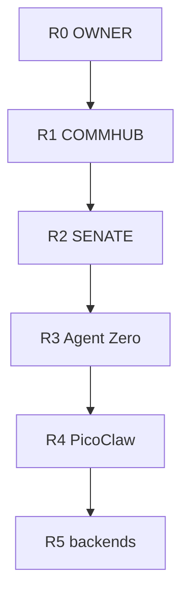

# LITE wrapper architecture

One brain. Under 8 GB. R0–R5. Not the OS.

```mermaid
flowchart TB
  R0[R0 OWNER] --> R1[R1 COMMHUB]
  R1 --> R2[R2 SENATE]
  R2 --> R3[R3 Agent Zero]
  R3 --> R4[R4 PicoClaw]
  R4 --> R5[R5 backends]
```
