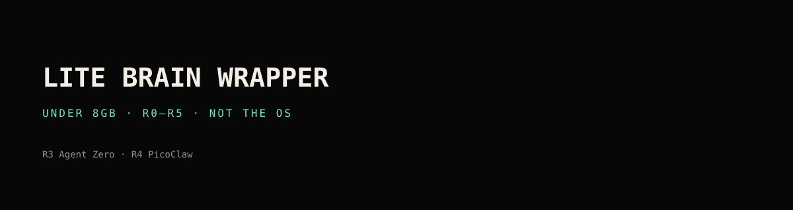
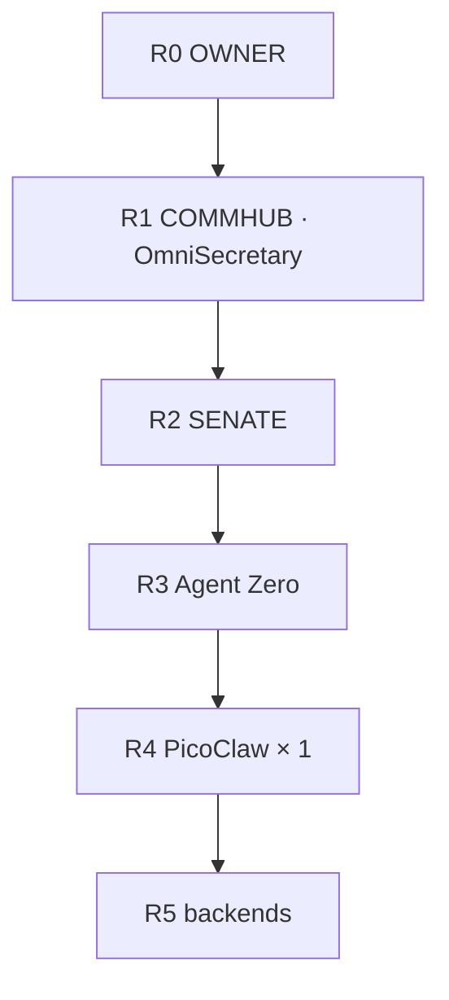

<p align="center">
  
</p>

<p align="center">
  
  
  
</p>

<p align="center"><b>One brain. Under 8 GB. Not BrainFrame OS. Not Helix.</b></p>

Sibling: [FULL wrapper (8 GB+)](https://github.com/CjPetersonIX/Brainframe-fullbrain-wrapper).

## Corporate tree



R2 seats: VP1 Claude Code · VP2 Codex · VP3 AGY · VP4 Grok Build.

Maps: [docs/HIERARCHY.md](docs/HIERARCHY.md) · [docs/RANKS.md](docs/RANKS.md).

## Install

```bash
curl -fsSL https://raw.githubusercontent.com/CjPetersonIX/Brainframe-litebrain-wrapper/main/install.sh | bash
```

## CKPT

`<NODE-ID> CKPT <MASTER>.<LOCAL>` · [handoff](https://github.com/CjPetersonIX/brainframe-handoff) · [qpulse](https://github.com/CjPetersonIX/brainframe-qpulse)
