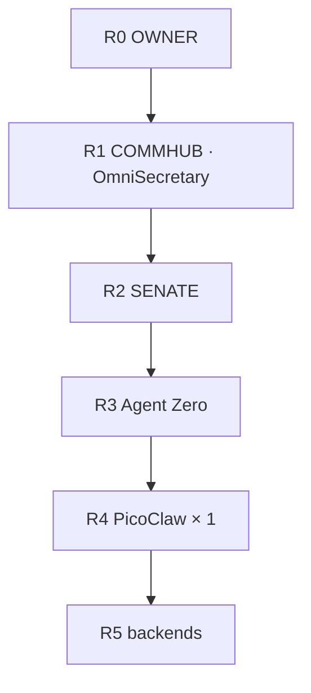

<p align="center">
  
</p>

<p align="center">
  
  
  
</p>

<p align="center"><b>One brain. Under 8 GB. Not BrainFrame OS. Not Helix.</b></p>

## Relation to BrainFrame OS (first glance)

1. **This repo is NOT the fleet OS.** Single-brain LITE wrapper (under 8 GB) only.
2. **Fleet live truth** = [BrainframeOS README](https://github.com/CjPetersonIX/BrainframeOS/blob/main/README.md) + [`docs/ops/2026-09-23_t786u_FIRST_GLANCE_CURRENT_STATE.md`](https://github.com/CjPetersonIX/BrainframeOS/blob/main/docs/ops/2026-09-23_t786u_FIRST_GLANCE_CURRENT_STATE.md).
3. **CKPT format:** `<NODE-ID> CKPT <MASTER>.<LOCAL>` · current fleet epoch tip **5291 OPEN** (5292 VOID).
4. **MasterQ / map / rules:** MasterQ [`comms/Q-PULSE.md`](https://github.com/CjPetersonIX/BrainframeOS/blob/main/comms/Q-PULSE.md) · map [`BRAINFRAME_MAP.md`](https://github.com/CjPetersonIX/BrainframeOS/blob/main/BRAINFRAME_MAP.md) · BrainframeOS README rules.

---


Sibling: [FULL wrapper (8 GB+)](https://github.com/CjPetersonIX/Brainframe-fullbrain-wrapper).

## Corporate tree



R2 seats: VP1 Claude Code · VP2 Codex · VP3 AGY · VP4 Grok Build.

Maps: [docs/HIERARCHY.md](docs/HIERARCHY.md) · [docs/RANKS.md](docs/RANKS.md).

## Install

```bash
curl -fsSL https://raw.githubusercontent.com/CjPetersonIX/Brainframe-litebrain-wrapper/main/install.sh | bash
```

## CKPT

`<NODE-ID> CKPT <MASTER>.<LOCAL>` · [handoff](https://github.com/CjPetersonIX/brainframe-handoff) · [qpulse](https://github.com/CjPetersonIX/brainframe-qpulse)
