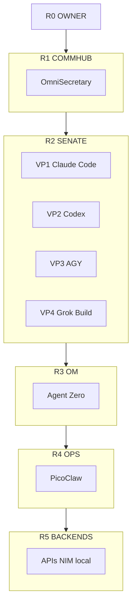

# Hierarchy — LITE wrapper

```mermaid
flowchart TB
  R0["R0 OWNER"]
  subgraph R1["R1 COMMHUB"]
    OS[OmniSecretary]
  end
  subgraph R2["R2 SENATE"]
    VP1[VP1 Claude Code]
    VP2[VP2 Codex]
    VP3[VP3 AGY]
    VP4[VP4 Grok Build]
  end
  subgraph R3["R3 OM"]
    Z[Agent Zero]
  end
  subgraph R4["R4 OPS"]
    P[PicoClaw]
  end
  subgraph R5["R5 BACKENDS"]
    B[APIs NIM local]
  end
  R0 --> R1 --> R2 --> R3 --> R4 --> R5
```

Command down. Approval up. R4 does not publish.
